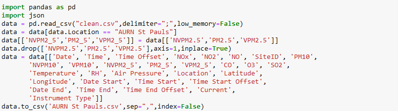
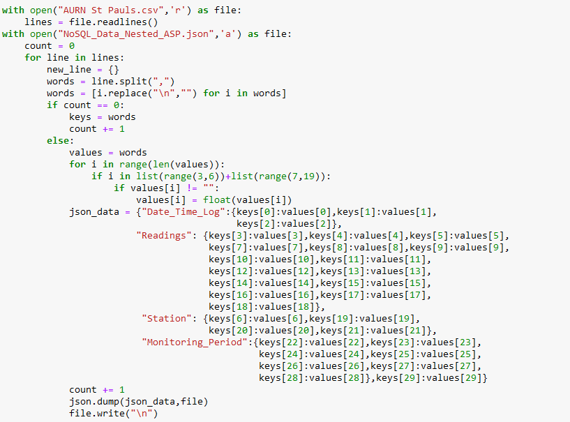
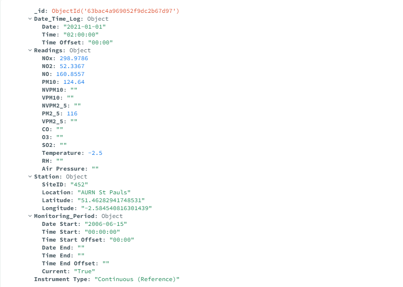
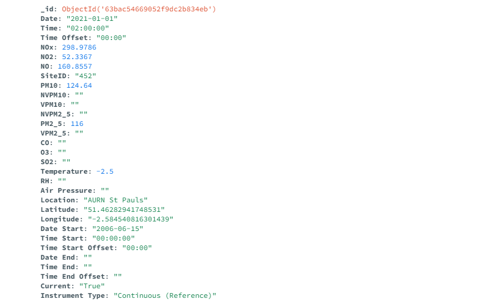
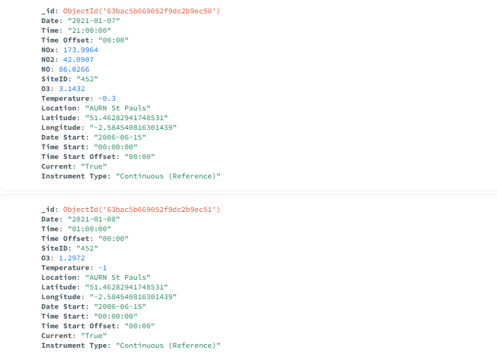
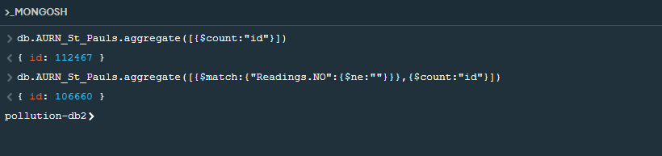
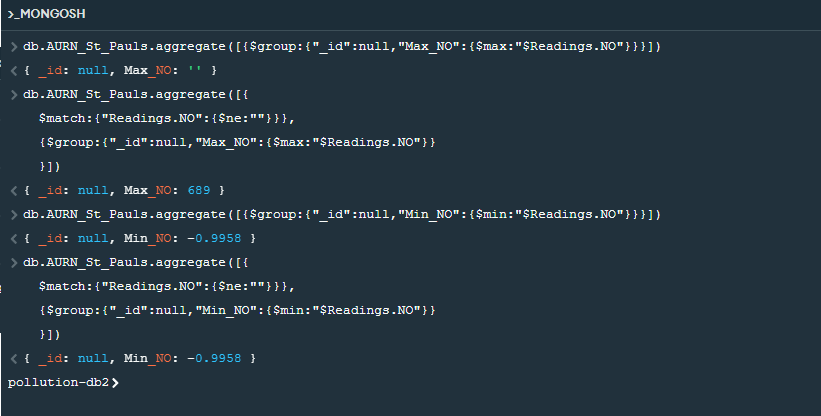
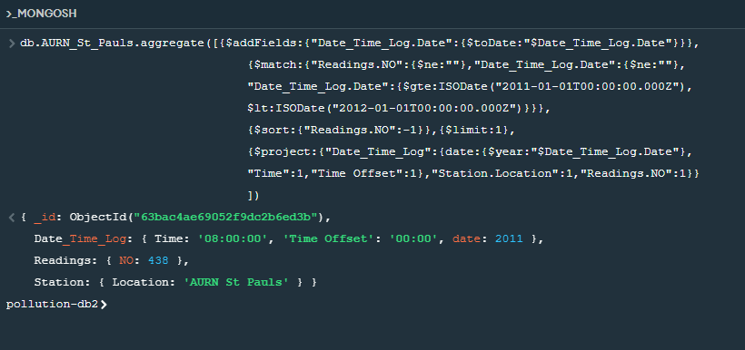

<h2 style="text-align: center;">NoSQL Pollution-db2 database</h2>

<h2> Background Study: </h2>

NoSQL commonly referred to as "Non-SQL" or "not only SQL" is an alternative to relational tabular structures used in SQL databases. Relational databases such as SQL were developed at a time when storage was expensive (Chen, J.-K. and Lee, W.-Z. (2019) “An introduction of NoSQL databases based on their categories and Application Industries,” <em>Algorithms</em>, 12(5), p. 106. Available at: https://doi.org/10.3390/a12050106. (Accessed 5th January 2023)). In SQL databases, data is stored in tabular structures and relationships are drawn between tables. Data is extracted by joining the tables as required. Consequently, SQL databases are highly rigid, complex and require vertical scaling. Moreover, complex queries with join operations across multiple relational tables might lead to bottlenecks in the performance.

Significant reductions in the cost of storage devices in the modern times allowed NoSQL to present itself as an alternative to SQL databases. However, NoSQL is not expected to replace SQL, but they are expected to tackle different classes of challenges.

<h2> Choosing a NoSQL Database </h2>

During this assignment, some of the existing database management systems are investigated (<em>NoSQL databases list by hosting data</em> - updated 2023 (2022) Hosting Data. Available at: https://hostingdata.co.uk/nosql-database/. (Accessed: January 5, 2023)). A brief summary of the finding is listed below:

- Document Store
	+ MongoDB
	+ ArangoDB
	+ CouchDB
- Key Value / Tuple Store
	+ DynamoDB
	+ redis
- Wide Column Store / Column Families:
	+ Hadoop
	+ Cassandra
- XML DBMS
	+ Sedna
	+ BaseX
- Graph DBMS
	+ Neo4J
	+ GraphBase
		

Due to the nature of the "air-quality-data.csv" data, wide column and document store-based DBMS are identified to be the most suitable options for this task. A document store type **MongoDB** database has been finally selected by taking the following factors into consideration:

- Popularity of the database 
- Ease of populating the database 
- Complexity of queries
- Familiarity with the data formats

While MongoDB queries are significantly more complex when compared to other databases such as Couchbase, taking the entire selection criteria into consideration, MongoDB presented itself as the most suitable option. Moreover, upon investing some time and effort, understanding of MongoDB queries could be significantly increased.
	

<h3> MongoDB Data Model for air-quality-data </h3>

In this section, the NoSQL data model implemented for the air-quality-data is discussed. Being a document-based database, the data in MongoDB is stored in groups of BSON documents called collections. Within each document in a collection, the data is stored as key-value pairs. Unlike relational databases such as SQL, documents in a MongoDB collection do not need a schema to be defined before inserting the data. Therefore, it is permitted to use different key-value structures across documents within a collection. However, it is possible to enforce schema validation rules for document update and insert operations within a collection (<em>Data Modeling Introduction — MongoDB Manual.</em> [online] Available at: https://www.mongodb.com/docs/manual/core/data-modeling-introduction/.(Accessed: January 6th 2023)).

<h4> Importing Data into MongoDB </h4>

A MongoDB database can either be populated using an insert operation or by importing the data from an existing csv or a JSON file. The following python script has been written to filter entries from air-quality-data belonging to "AURN St Pauls" site and generate a csv file which is imported into the MongoDB database:

This site has been selected as it has a diverse set of available readings. The fields 'NVPM2.5', 'PM2.5' and 'VPM2.5' are renamed to 'NVPM2_5', 'PM2_5' and 'VPM2_5' respectively as MongoDB does not permit inserting a "." within a key name.

However, it has been observed that converting the csv data to the correct JSON structure gives more control and automates certain tasks such as creating nested objects without any need for additional queries. The following python script is written to convert csv data into the desired JSON format:

For each key-value pair, the column name is stored as the key and the corresponding value for each entry is stored as the value. For the case of nested structure, additional nested objects are added to group key-value pairs into relevant categories. The figure below shows a MongoDB document consisting of a single entry from the air-quality-data using a nested document structure. In this document, based on the nature of the key-value data, nested objects are used to group key-value pairs.

The figure below shows a MongoDB document using a simple document structure with no nested objects. In this document, all the key-value pairs are added to a single hierarchy with no nested objects. 

While the document with nested key-value pairs looks more organised with similar key-value pairs grouped together when compared to a simple document structure, no significant difference is observed between the two types. However, it seems pertinent to observe that if a combination of both nested and simple document structures are used or if different nested structures are used in a single collection, querying and extracting data from the database might become unreliable.

Since no schema is required for the database, the entries within each document could be different. This allows the possibility to organize data more efficiently in each document. From the earlier figures showing the document structures, it can be observed that documents contain missing or null values. They can be eliminated with each document only consisting of non-trivial data as shown in the figure below. 

In either of the above cases, an embedded document structure is used with all the data from each air-quality-data entry in a single document in denormalized form. 

<h4> Normalization vs Denormalization </h4>
In traditional relational databases such as SQL, the data is stored in normalized form with the most widely used normalization level being the 3rd normal form. Normalization can be defined as the process in which the data in a database is stored in multiple tables as required and the tables are joined using pre-defined relations. Key attributes are defined for each table and they are used to identify relations between tables. 

The criteria to achieve 3rd normal form (which also satisfies the criteria necessary for 1st and 2nd normal forms) are:

* Each data field contains a single value with all the composite values resolved (1st normal form)
* Eliminate partial functional dependencies and repeating groups (2nd normal form)
* Eliminate transitive dependencies i.e., every non-key attribute must be related to primary key and primary key alone

The intention behind normalization is to resolve issues surrounding data redundancies and data anomalies. The denormalized data structures used in NoSQL databases allow data redundancy to achieve faster querying. Some of the main differences between normalization and de-normalization are

|           |           |
|:----------|:----------|
|Normalization|Denormalization|
|Removes redundancy to achieve consistency |Adds redundancy for faster reads |
|Optimized memory usage |Increased memory usage due to data redundancy |
|Ensures data integrity |Does not ensure data integrity |
|Better suited for applications which emphasise data integrity and tolerate computationally intense joins |Better suited for applications which require faster execution or queries where joins could be computationally expensive |
|Better suited for databases which require frequent insert/update/delete operations |Better suited for databases which require frequent queries |

Considering the above information, NoSQL database seems to be the most suitable choice for air-pollution-data since it does not require any updates other than inserting new data but queries on the existing data could be frequent. 

<h3> MongoDB Querying </h3>
In MongoDB, queries to read the data are implemented in MONGOSH terminal. A simple query to count the total number of entries and non-null entries inserted into the "AURN_St_Pauls" collection consisting of data from the "AURN St Pauls" station is shown below:

In databases such as air-quality-data, it is common to query the data to identify the maximum or minimum values of a parameter. The example below demonstrates few queries to identify maximum and minimum values of 'NO'.

The query to identify the maximum values initially returned a null value instead of the maximum value. To work around this problem an additional sub-query is included to  ignore nulls before identifying the maximum value. No such issues were observed for the case of minimum value.

Similarly, the query to identify the maximum value of NO for the year 2011 is shown below:

Similar to the previous case, to avoid null values interfering with the aggregate operations, sub-queries were included to ignore nulls in NO and Date fields. The query is written in 4 parts as follows:

* Date is converted to ISO date time format using $addFields method
* Queries were written to ignore null values in NO and Date fields and filter by documents where year is 2011 using $match method
* Documents are sorted based on the descending values of NO and return the first entry to obtain the entry with maximum value of NO for the year 2011. $sort method is used to achieve this
* Key-values pairs to be returned are defined using the $project method

<h3> Conclusion </h3>

MongoDB is one of the widely used NoSQL databases. Designing and implementing a NoSQL database in MongoDB provided me an excellent learning opportunity to increase my understanding of MongoDB and NoSQL databases. Other learning outcomes from this task include better understanding of:

* Differences between and SQL and NoSQL databases
* Choosing between a SQL or a NoSQL database
* MongoDB queries
* JSON and BSON data formats

While the objective of implementing and querying a MongoDB database is achieved while working on this task, further understanding of MongoDB queries is still required and I intend to continue working on it beyond this task. 

