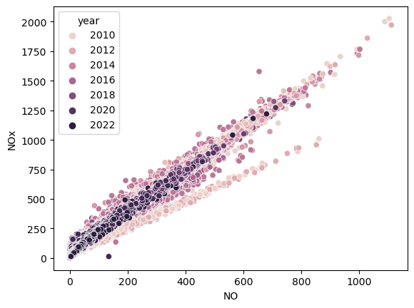
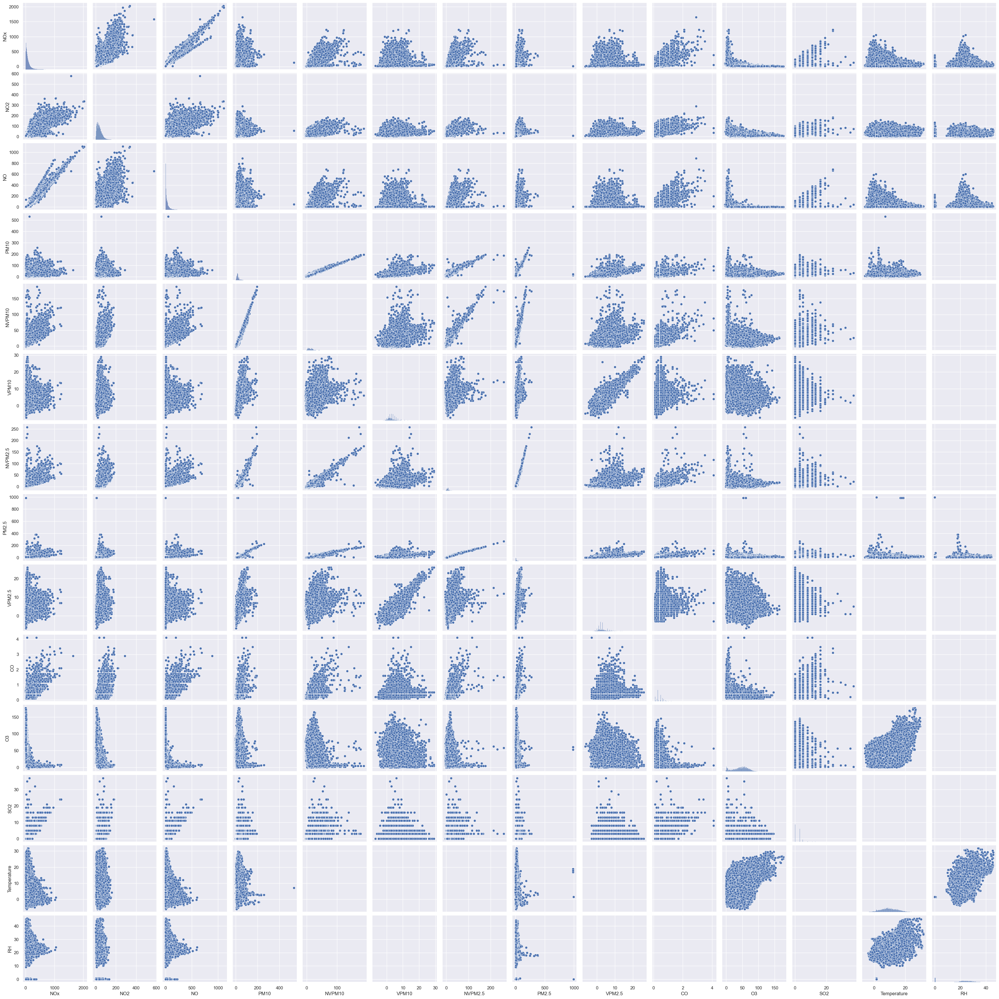
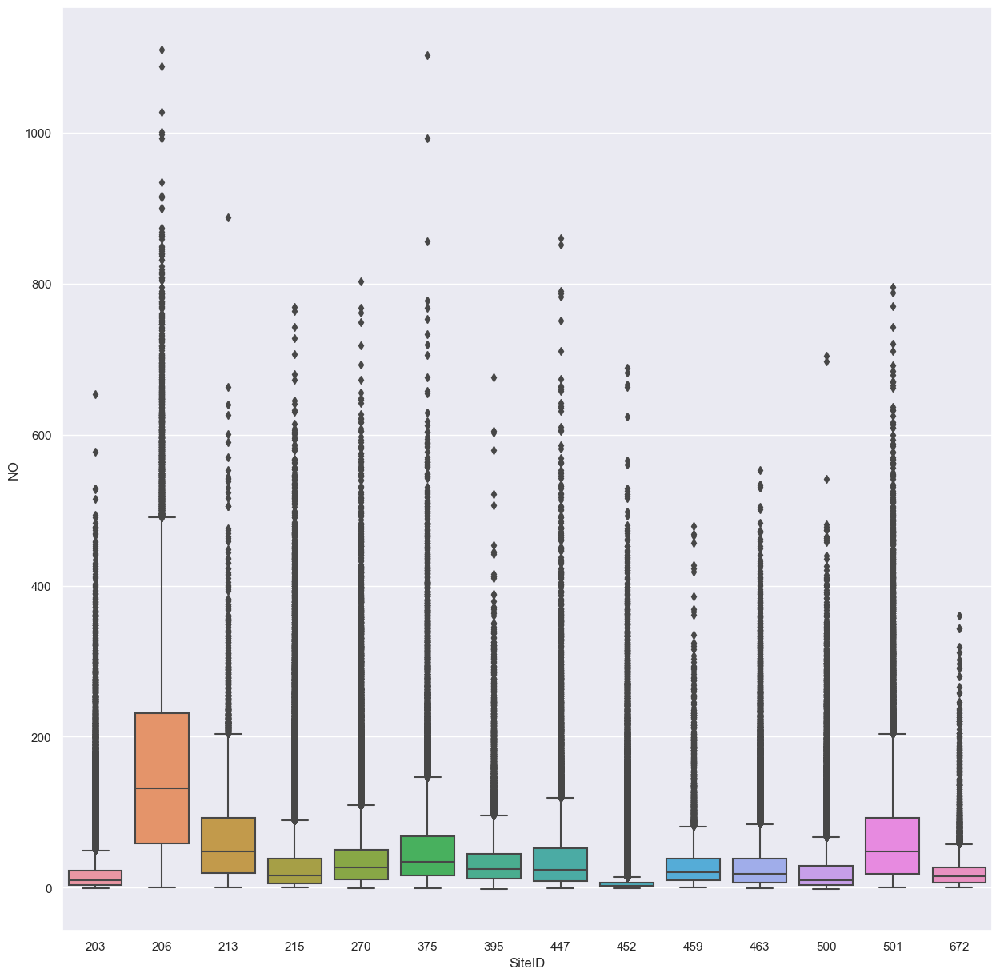

<h2 style="text-align: center;"> Reflective Report (UFCFLR-15-M 22SEP/1) </h2>

This report summarizes various tasks undertaken to develop a SQL and NOSQL databases using "air-quality-data.csv" data. Various task involved in the project are discussed in the following sections. 

<h3> Task1: Crop, Cleanse and Refactor the Data </h3>

In this task, the input air-quality-data is cropped and cleaned to remove the unwanted entries. 

For the crop task, the data is cropped to remove all the entries with either a missing "Date Time" value or entries recorded prior to the year 2010. The cropped data is written to a file named "crop.csv". For the clean task, entries with mismatched SiteID and Location pairs are removed. The data is further cleaned by splitting selected columns into multiple fields. The cleaned data is written to "clean.csv".

While data processing operations using the pandas method are relatively less complex, it comes at a cost of increased processing times. Using the python open() function to read the data and performing string processing on each of the lines is found to lower the processing times. 

The learning outcomes from this task include,
* Reading csv files and processing the data
* Analysing the data and identifying anomalies
* Data manipulation to clean the data

<h3> Task2: Create and Implement a Relational Database (MySQL) </h3>

In this task, an ER model in the 3rd normal form is designed using MySQL Workbench. Information related to entities and attributes is obtained during exploratory analysis. Three entities named Site, Reading and Schema are defined and primary and foreign keys are specified to establish relationships between Site and Reading tables. Using two tables to store site and reading data reduces data redundancy and prevents update and insert anomalies. Schema table consists of the information regarding the values in the database. 

A "Forward Engineer" operation is performed to generate a pollution-db database. A pollution.sql script is generated during this process which contains the required table definitions.

The learning outcomes from this task include,
* Using MySQL Workbench to design ER diagrams and using PHPMyAdmin
* Understanding concepts of primary and foreign keys and how they define relationships between tables
* Understanding different types of relationships and how they generate insert and update rules

<h3> Task3: Python Scripts to Populate the Database & Generate SQL </h3>

In this task, a python script is written which creates a database instance called pollution-db2 and populate it using the previously generated "clean.csv" file. This task requires establishing a connection with the sql database before executing the queries. 

To create and populate the SQL database, two functions have been written. The first function establishes a connection to SQL server, creates a database and connects to the database. The second function takes a list of SQL queries defined as strings and executes them in the connected SQL server. 

For the second part of this task, python string processing is used to generate SQL insert queries with required data. The process is iterated to populate the database. A similar process followed to insert first 100 entries and the queries are written to a file named "insert-100.sql"

<h4> Challenges and Learning Outcomes</h4>
Some of the most significant challenges faced when addressing this task are:

* Reading data from the csv file and populating SQL databases
* A few SiteIDs have multiple geo_point values which caused duplicate errors while attempting to populate the Site table. To avoid this problem drop_duplicates method in pandas is used to drop all the duplicate entries except the first instance
* To prevent SQL replacing missing values with 0, missing values are converted to "None" in the python script before populating the database. This allowed the SQL database to correctly interpret the missing values as "NUll".

<h3> Task4: Design, Write and Run SQL Queries </h3>

In this task, SQL queries have been written to return the desired outputs from the database. Some of the key challenges faced during this task include,

* Query-a requires returning date/time, station name and the highest recorded value of nitrogen oxide (NOx) for the year 2019. It has been observed that SQL allows columns in the select statement which are not included in the aggregate function. To work around this problem, a sub-query is written to sort data by the value of Nox field in descending order and to return the first entry. This is joined with the site table to return desired result. 
* Queries b and c require using sub-queries to return the desired results.

<h3> Task5: Model, Implement and Query a Selected NoSQL Database </h3>

Task5 involves designing and implementing a NoSQL database and running queries on the data. Considering the nature of the data, MongoDB is selected and the database is implemented in de-normalized form. Some of the challenges faced during this task are.

* Populating the database with relevant data has been a challenging task. Data formats used by MongoDB are investigated and python script has been written to generate the data in the required JSON format.
* Writing MongoDB queries has been a challenging task. Necessary information is gathered by referring to online resources and MongoDB documentation.

<h3> Data Visualisation </h3>

Some of the widely used libraries such as Matplotlib, Seaborn, Plotly, etc, are considered to visualise the data. For the purpose of visualisation, air-quality-data relationships can be classified into three categories:

* Time series: Relationships with date-time fields 
* Continuous: Relationships between measurement data fields
* Categorical: Relationships with fields such as SiteID, Location, Instrument type etc

For time series data, plotting tools such as line plot can be used. The figure below shows an example for time series plot, seaborn.lineplot() to visualise NO levels over the years:

For continuous data, visualisation tools such as scatter plot, regression plots such as seaborn.lmplot(), correlation plots, etc, can be used. Figures below show a scatter plot and seaborn pair plots to visualise correlations between different readings:

For categorical data, different variations of box plots, bar plots, etc. can be used. The box plot below shows the distribution of NO for each SiteID over the years: 

